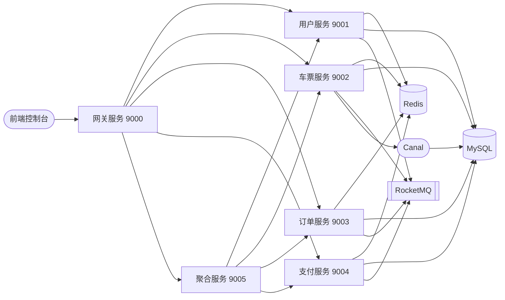

<div align="center">

# 云途 CloudRail · 铁路票务交易中台

**面向铁路出行场景的高并发票务交易系统**

[](https://www.oracle.com/java/)
[](https://spring.io/projects/spring-boot)
[](https://sca.aliyun.com/)
[](./LICENSE)

</div>

---

## 项目简介

云途 CloudRail 是一套面向铁路出行场景的票务交易系统，覆盖用户注册登录、车次与站点查询、区间余票查询、在线选座购票、订单管理、支付与退款、乘车人管理等完整购票链路。

系统以出行高峰期的高并发抢票为核心挑战，重点解决三个问题：**区间余票的精确扣减与防超卖**、**座位的高效分配**、**订单、支付、库存三方数据的最终一致**。工程上采用清晰的分层与模块化设计，配合统一响应、统一错误码、参数校验与可插拔的业务扩展点，保证复杂业务的长期可维护性。

## 功能一览

| 模块 | 能力 |
| --- | --- |
| 用户中心 | 用户名/手机号/邮箱多方式登录、乘车人管理、注销与账号复用 |
| 车票查询 | 站点联想、车次/车组/出发到达/出发时间多条件组合查询、区间余票展示 |
| 购票下单 | 在线选座、席别选择、多乘车人批量下单、订单确认 |
| 订单中心 | 订单创建/分页查询/详情、超时未支付自动关闭、取消订单并回滚份额 |
| 支付中心 | 支付单创建、支付回调处理、退款单创建、退票回流库存 |
| 网关层 | 统一鉴权、路由转发、用户上下文透传 |
| 聚合层 | 面向前端的 BFF 接口聚合 |

## 核心设计

### 1. 站点区间余票令牌桶

票务余量是**区间维度**的，一张北京南 → 南京南的车票会同时占用途经的每一段区间，简单的总量扣减会导致超卖。

系统以 Redis Hash 存储 `车次 → {起止站组合: 余票令牌}`，令牌的**扣减与回滚全部由 Lua 脚本原子执行**；令牌桶初始化前通过分布式锁做双重检查，避免并发重复加载。订单取消或超时未支付时执行反向 Lua 脚本回滚令牌，保证份额与数据库一致。

### 2. BitMap 座位占用与选座算法

座位占用按「列车途经站 × 座位」建模为位图：每个座位维护一个 bit 序列，下标对应途经站序号，区间被占用时对应位为 1；判断某座位在一段区间是否可用，等价于判断该区间所有位是否为 0——把逐行扫描数据库变成了纯内存位运算。

商务座、一等座、二等座各自的差异逻辑通过**策略模式 + 模板方法**隔离；选座时优先同车厢相邻座位，不满足则降级为同车厢不相邻，最后才跨车厢分配。

### 3. 可插拔的业务编排

购票主流程由**责任链**串联：参数非空校验 → 令牌桶余票校验 → 重复购票校验 → 库存校验。新增一条校验规则只需新增 Handler 实现并注册到链上，主流程代码零改动。余票查询与退票各自独立成链，通过 `mark` 隔离。

### 4. 数据一致性保障

- **超时关单**：下单成功后投递延迟消息，到期触发关单并回滚余票令牌
- **库存回补**：订阅 MySQL binlog，异步回刷余票缓存与令牌桶，兜底缓存与数据库不一致
- **支付结果广播**：支付结果经消息队列广播至订单服务与车票服务
- **幂等**：自研幂等组件（注解 + AOP），支持参数幂等、Token 幂等、消息幂等三种策略，配合数据库唯一索引作为最后防线

### 5. 分库分表与分布式 ID

订单、支付、退款表采用 ShardingSphere **自定义复合分片算法**，按用户维度哈希分库分表，规避跨库查询。订单号使用雪花算法生成，`workId` 由 Redis 统一分配并落本地文件兜底，规避 `workId` 冲突与时钟回拨。

### 6. 稳定性与可观测性

Sentinel 限流熔断；Hippo4j 动态线程池，核心参数托管在配置中心可热更新；Micrometer + Prometheus 埋点；统一异常码与全局异常处理；全链路用户信息透传（JWT + TransmittableThreadLocal）。

## 系统架构



| 服务 | 端口 | 职责 |
| --- | --- | --- |
| `cloudrail-gateway-service` | 9000 | 统一入口、鉴权、路由 |
| `cloudrail-user-service` | 9001 | 用户、登录、乘车人 |
| `cloudrail-ticket-service` | 9002 | 车站、车次、余票、购票、退票 |
| `cloudrail-order-service` | 9003 | 订单生命周期管理 |
| `cloudrail-pay-service` | 9004 | 支付与退款 |
| `cloudrail-aggregation-service` | 9005 | 面向前端的接口聚合 |

## 快速开始

### 环境要求

| 组件 | 版本 |
| --- | --- |
| JDK | 17+ |
| Maven | 3.8+ |
| MySQL | 8.0+ |
| Redis | 6.0+ |
| RocketMQ | 4.9+ |
| Nacos | 2.x |
| Canal | 1.1.6+ |
| Node.js（可选，前端控制台） | 16+ |

### 构建

```bash
# 后端（含 Spotless 格式化与 Checkstyle 静态检查）
./mvnw clean install

# 前端控制台
cd console-vue
npm install && npm run dev
```

> `-o` 可在已缓存依赖时进行离线构建。

### 启动顺序

中间件先行，随后按依赖顺序启动服务：

```text
MySQL → Redis → RocketMQ → Nacos → Canal
   ↓
user-service → ticket-service → pay-service → order-service → gateway-service
```

聚合服务可单独部署，用于替代微服务模式下的多服务组合调用，适合本地快速验证。

## 工程规范

| 维度 | 落地方式 |
| --- | --- |
| 代码风格 | Spotless 格式化 + Checkstyle 静态检查，构建阶段强制校验 |
| 统一契约 | 统一响应体 `Result`、统一错误码 `IErrorCode`、全局异常处理 |
| 参数校验 | 入口统一校验，配合业务责任链做二次校验 |
| 幂等 | 注解驱动的幂等组件，支持三种幂等策略 |
| 日志 | 日志切面自动记录出入参、耗时与链路标识 |
| 数据脱敏 | 身份证、手机号等敏感字段由自定义序列化器统一脱敏 |
| 分层 | Controller / Service / Manager / DAO 四层，DTO 与 DO 严格隔离 |

## 项目结构

```text
cloudrail/
├── checkstyle/            静态检查规则
├── format/                代码格式化模板
├── frameworks/            自研基础组件 Starter（11 个）
│   ├── base               通用基类与上下文持有者
│   ├── cache              多级缓存抽象
│   ├── common             线程池、工具类
│   ├── convention         统一响应与异常规范
│   ├── database           数据访问配置与分片算法
│   ├── designpattern      策略、责任链抽象
│   ├── distributedid      分布式 ID 生成器
│   ├── idempotent         幂等组件
│   ├── log                日志切面
│   └── web                Web 层统一处理
├── services/              业务服务
├── resources/             初始化 SQL 与数据
├── console-vue/           前端控制台
└── tests/                 通用测试模块
```

## 后续规划

- [ ] 候补购票
- [ ] 改签流程
- [ ] 防刷风控（同 IP / 同设备限购）
- [ ] 支付对账与补偿任务
- [ ] 抢票链路压测报告

## 开源许可

本项目基于 [Apache License 2.0](./LICENSE) 开源。源码中已经附加的原项目版权声明予以保留。

本项目在 Apache-2.0 许可的开源项目基础上进行二次开发，重点重构了车票域的余票模型与选座算法，并在此基础上补充了工程规范与可观测性建设。

## 联系方式

如有问题或建议，欢迎提交 [Issue](../../issues)。提交 Pull Request 前请先跑通 `./mvnw clean install`。
